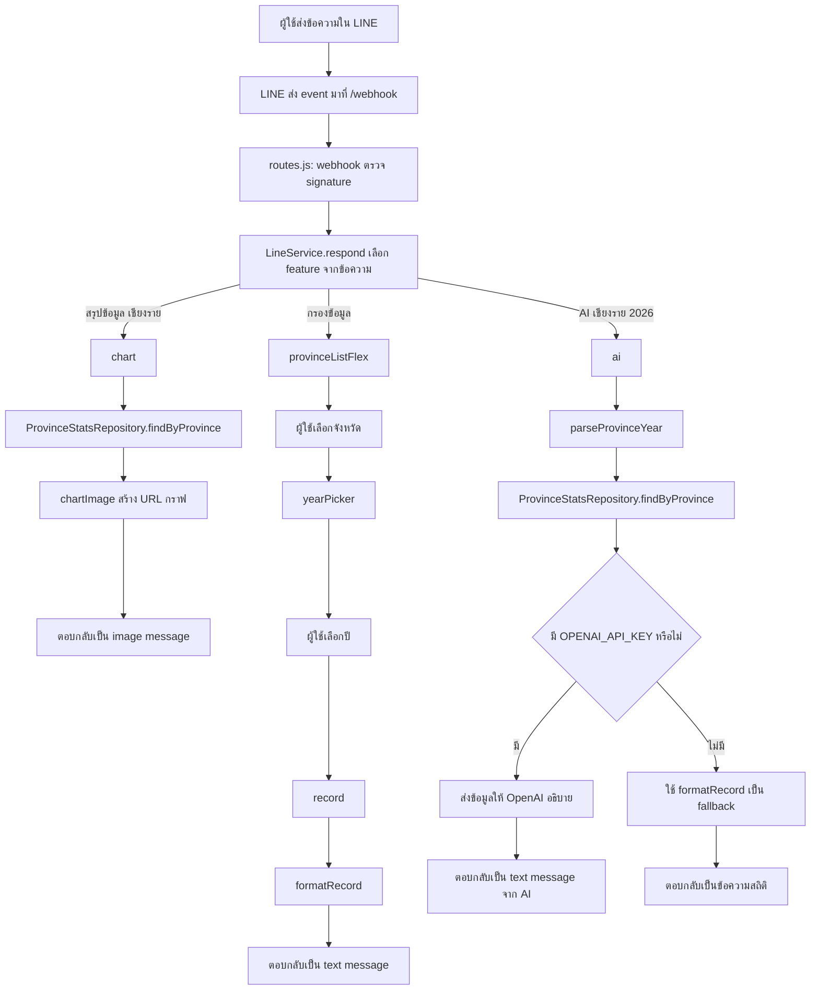

# LINE OA + AI Health Assistant Workshop

คู่มือนี้จัดทำขึ้นสำหรับผู้เริ่มต้นที่ยังไม่มีพื้นฐานการเขียนโปรแกรม ผู้เรียนสามารถทำตามได้ทีละขั้น โดยคัดลอกโค้ดไปวางและทดสอบผลลัพธ์เป็นระยะ เนื้อหาจะอธิบายการรับข้อความจากผู้ใช้ผ่าน LINE Official Account การส่งข้อมูลมายัง server และการใช้ AI เพื่อช่วยอธิบายข้อมูล

โปรเจกต์นี้ประกอบด้วย 3 feature ให้สอดคล้องกับ Rich Menu ใน `assets/linerichmenu.jpg`

1. `สรุปข้อมูล` สร้างกราฟจากข้อมูลรายจังหวัด
2. `กรองข้อมูล` เลือกจังหวัด แล้วเลือกปี
3. `AI` อธิบายข้อมูลที่ query ได้เป็นภาษาไทย

## ภาพรวม



คำศัพท์ที่ใช้ในคู่มือนี้:

- LINE OA คือบัญชี LINE Official Account ที่ผู้ใช้เพิ่มเป็นเพื่อน
- Messaging API คือระบบที่ทำให้ server สามารถสื่อสารกับ LINE OA ได้
- Webhook คือ URL ที่ LINE จะส่ง event มายัง server เมื่อผู้ใช้พิมพ์ข้อความ
- Channel secret ใช้ตรวจว่า request มาจาก LINE จริง
- Channel access token ใช้ให้ server ส่งข้อความตอบกลับ LINE

## สิ่งที่ต้องเตรียมก่อนเริ่ม

ติดตั้งในเครื่อง:

- Node.js 20 ขึ้นไป: https://nodejs.org/en/download
- Visual Studio Code: https://code.visualstudio.com/download
- REST Client extension ใน VS Code: https://marketplace.visualstudio.com/items?itemName=humao.rest-client
- Postman หากไม่ใช้ REST Client: https://www.postman.com/downloads/
- Insomnia หากไม่ใช้ REST Client: https://insomnia.rest/download

โปรแกรมสำหรับเปิด webhook จากเครื่อง local เพื่อให้ LINE เรียกใช้งานได้:

- ngrok: https://ngrok.com/download
- Cloudflare Tunnel: https://developers.cloudflare.com/cloudflare-one/connections/connect-networks/downloads/

บัญชีที่ต้องมี:

- LINE account
- LINE Official Account
- LINE Developers account
- OpenAI API key หากต้องการเปิดฟีเจอร์ AI จริง

หากยังไม่มี OpenAI API key โปรเจกต์ยังสามารถรันได้ แต่คำสั่ง `AI เชียงราย 2026` จะตอบกลับเป็นข้อความสถิติทั่วไปแทน

## โครงสร้างไฟล์

```text
cmu-workshop-line-ai/
├── api.http
├── package.json
├── .env
├── backend/
│   ├── server.js
│   ├── routes.js
│   ├── core.js
│   └── data/
│       └── province_stats.json
├── frontend/
│   └── index.html
└── assets/
    └── linerichmenu.jpg
```

ไฟล์หลักที่ใช้ในคู่มือนี้:

- `backend/server.js` เปิดเว็บ server
- `backend/routes.js` สร้าง API และ webhook
- `backend/core.js` เก็บ logic ของบอต
- `api.http` ใช้ทดสอบ request
- `.env` เก็บ secret ต่าง ๆ ห้ามส่งไฟล์นี้ขึ้น public repo

## ขั้นตอนที่ 1: สร้าง `package.json` และติดตั้ง package

เปิดไฟล์ `package.json` แล้ววาง code นี้:

```json
{
    "name": "cmu-workshop-line-ai",
    "version": "1.0.0",
    "description": "LINE Bot + AI Health Assistant workshop",
    "type": "module",
    "scripts": {
        "start": "node backend/server.js",
        "dev": "node --watch backend/server.js"
    },
    "engines": {
        "node": ">=20"
    },
    "dependencies": {
        "@line/bot-sdk": "^11.0.2",
        "dotenv": "^16.4.0",
        "express": "^4.21.0",
        "openai": "^6.45.0"
    }
}
```

ส่วนสำคัญของไฟล์นี้:

- `"type": "module"` ทำให้สามารถใช้ `import ... from ...` ได้
- `"start"` ใช้รัน server แบบปกติ
- `"dev"` ใช้รัน server แบบ watch เมื่อแก้ไฟล์แล้ว Node จะ restart ให้
- `"dependencies"` คือ package ที่โปรเจกต์ต้องใช้

จากนั้นเปิด terminal ในโฟลเดอร์โปรเจกต์ แล้วรันคำสั่ง:

```bash
npm install
```

คำสั่งนี้จะติดตั้ง package ที่โปรเจกต์ต้องใช้:

- `express` สำหรับสร้าง server
- `dotenv` สำหรับอ่านไฟล์ `.env`
- `@line/bot-sdk` สำหรับตอบกลับ LINE
- `openai` สำหรับเรียก AI

### Checkpoint 1: ตรวจว่า Node และ package พร้อมแล้ว

ตรวจ version ของ Node และ npm:

```bash
node -v
npm -v
```

หากติดตั้งถูกต้อง จะแสดงเลข version เช่น `v20...` หรือสูงกว่า

ตรวจว่า `package.json` อ่านได้:

```bash
node -e "console.log(require('./package.json').scripts)"
```

ผลลัพธ์ควรแสดง `start` และ `dev`

จากนั้นตรวจสอบว่า dependency ถูกติดตั้งเรียบร้อยแล้ว:

```bash
npm list express dotenv @line/bot-sdk openai
```

หากไม่มี error แสดงว่าสามารถดำเนินการขั้นตอนถัดไปได้

## ขั้นตอนที่ 2: สร้างไฟล์ `.env`

สร้างไฟล์ชื่อ `.env` ที่ root ของโปรเจกต์ แล้วใส่:

```env
PORT=3000
LINE_CHANNEL_SECRET=
LINE_CHANNEL_ACCESS_TOKEN=
OPENAI_API_KEY=
OPENAI_MODEL=gpt-4.1-mini
```

ในช่วงแรกสามารถเว้นค่า LINE และ OpenAI ไว้ก่อนได้ เนื่องจากจะเริ่มจากการทดสอบ API บนเครื่อง local ก่อน

### Checkpoint 2: ตรวจว่า `.env` ถูกอ่านได้

ก่อนรันคำสั่งนี้ ให้ตรวจสอบว่า terminal อยู่ที่ root ของโปรเจกต์ เช่นโฟลเดอร์ `cmu_workshop_line_ai` ไม่ใช่โฟลเดอร์อื่น

รัน:

```bash
node -r dotenv/config -e "console.log(process.env.PORT)"
```

ผลลัพธ์ที่ควรได้:

```text
3000
```

หากได้ค่า `undefined` ให้ตรวจสอบ 2 จุดนี้:

1. terminal อยู่ผิดโฟลเดอร์ ให้ใช้ `cd` กลับมายัง root ของโปรเจกต์ก่อน
2. ไฟล์ `.env` ยังไม่มีบรรทัด `PORT=3000`

ใช้คำสั่งนี้เพื่อตรวจว่า `.env` มี key อะไรบ้าง โดยไม่แสดงค่า secret:

```bash
node -e "const fs=require('fs'); console.log(fs.readFileSync('.env','utf8').split(/\r?\n/).filter(line=>line && !line.startsWith('#')).map(line=>line.split('=')[0]).join('\n'))"
```

## ขั้นตอนที่ 3: สร้าง server

เปิดไฟล์ `backend/server.js` แล้ววาง code นี้:

```js
import 'dotenv/config';
import express from 'express';
import { fileURLToPath } from 'url';
import path from 'path';
import router from './routes.js';

const __dirname = path.dirname(fileURLToPath(import.meta.url));
const FRONTEND_DIR = path.join(__dirname, '..', 'frontend');

const app = express();
app.use(express.static(FRONTEND_DIR));
app.use(router);

const PORT = process.env.PORT || 3000;
app.listen(PORT, () => console.log(`http://localhost:${PORT}`));
```

คำอธิบายโค้ดส่วนนี้:

- `dotenv/config` อ่านค่าใน `.env`
- `express.static` ทำให้เปิดไฟล์ใน `frontend/` ได้
- `router` คือ route ทั้งหมดที่จะเขียนใน `backend/routes.js`

### Checkpoint 3: ตรวจ syntax ของ server

ในขั้นตอนนี้ยังไม่จำเป็นต้องรัน server เนื่องจาก `routes.js` และ `core.js` จะถูกเขียนในขั้นตอนถัดไป ให้ตรวจสอบก่อนว่าไฟล์นี้ไม่มี syntax error:

```bash
node --check backend/server.js
```

หากผ่าน จะไม่มีข้อความ error แสดงออกมา

## ขั้นตอนที่ 4: Draft layout ของ `backend/core.js`

ก่อนวางโค้ดทั้งหมด ให้พิจารณาโครงร่างของไฟล์ก่อนว่าแบ่งออกเป็นส่วนใดบ้าง

```js
// [C1] import package

// [C2] constant ข้อความและรายการจังหวัด

// [C3] ProvinceStatsRepository
// อ่านข้อมูล JSON และค้นหาข้อมูลจังหวัด

// [C4] helper functions
// สร้างข้อความ, parse จังหวัด+ปี, สร้าง chart URL

// [C5] Flex Message
// สร้างปุ่มเมนูสำหรับ LINE

// [C6] LineService
// รับข้อความผู้ใช้ แล้วเลือกว่าจะทำ feature ไหน

// [C7] validSignature
// ตรวจ webhook signature จาก LINE
```

เมื่ออ่านโค้ด ให้พิจารณาโครงสร้างนี้เป็นหลัก: repository ใช้ค้นหาข้อมูล, helper ใช้สร้าง response และ LineService ใช้ควบคุม flow หลัก

เมื่อคัดลอกโค้ด ให้สังเกตหมายเลขใน comment เช่น `// [C3] ProvinceStatsRepository` แล้ววางไว้ใต้ section หมายเลขเดียวกันในไฟล์ `backend/core.js`

## ขั้นตอนที่ 5: เริ่มเขียน `backend/core.js`

เปิดไฟล์ `backend/core.js` แล้วเริ่มจาก import และค่าคงที่:

```js
// [C1] import package
import { readFileSync } from 'fs';
import { createHmac, timingSafeEqual } from 'crypto';
import * as line from '@line/bot-sdk';
import OpenAI from 'openai';

// [C2] constant ข้อความและรายการจังหวัด
const RATE_FIELDS = ['patient', 'patient_rate', 'dead', 'dead_rate', 'cfr'];
const FEATURE_TEXT =
    'เลือกเมนูจาก Rich Menu หรือพิมพ์:\n' +
    '- สรุปข้อมูล เชียงราย\n' +
    '- กรองข้อมูล\n' +
    '- AI เชียงราย 2026';
const CHART_PROMPT = 'พิมพ์ "สรุปข้อมูล ชื่อจังหวัด" เช่น "สรุปข้อมูล เชียงราย"';
const AI_PROMPT = 'พิมพ์ "AI ชื่อจังหวัด ปี" เช่น "AI เชียงราย 2026"';
const QUICK_PROVINCES = ['เชียงราย', 'เชียงใหม่', 'กรุงเทพมหานคร', 'ชลบุรี', 'นครราชสีมา', 'ขอนแก่น'];
```

คำอธิบายโค้ดส่วนนี้:

- `RATE_FIELDS` คือ field ที่ API อนุญาตให้ filter ได้
- `FEATURE_TEXT` คือข้อความ fallback หากผู้ใช้พิมพ์ไม่ตรง pattern
- `QUICK_PROVINCES` คือจังหวัดที่จะแสดงในเมนูกรองข้อมูล

### Checkpoint 4: ตรวจ syntax หลังเริ่ม `core.js`

รัน:

```bash
node --check backend/core.js
```

หากผ่าน แสดงว่า import และค่าคงที่ถูกต้อง

## ขั้นตอนที่ 6: เพิ่ม Repository สำหรับอ่านข้อมูล

วางต่อจากค่าคงที่:

```js
// [C3] ProvinceStatsRepository — อ่านข้อมูล JSON และค้นหาข้อมูลจังหวัด
export class ProvinceStatsRepository {
    constructor(path) {
        this.items = JSON.parse(readFileSync(path, 'utf-8'));
        this.defaultYear = Math.max(...this.items.map(item => item.year));
    }

    findByProvince(name, year) {
        const keyword = name.trim().toLowerCase();
        const matches = this.items
            .filter(item => item.province.toLowerCase().includes(keyword))
            .filter(item => year === undefined || item.year === year)
            .sort((a, b) => a.year - b.year);
        if (!matches.length) return null;
        return year === undefined ? matches : matches[0];
    }

    yearsByProvince(name) {
        const records = this.findByProvince(name);
        return records ? records.map(item => item.year) : [];
    }

    query({ field = 'patient_rate', min, max, year = this.defaultYear } = {}) {
        const rateField = RATE_FIELDS.includes(field) ? field : 'patient_rate';
        return this.items
            .filter(item => item.year === year)
            .filter(item => min === undefined || item[rateField] >= min)
            .filter(item => max === undefined || item[rateField] <= max)
            .sort((a, b) => b[rateField] - a[rateField]);
    }
}
```

คำอธิบายโค้ดส่วนนี้:

- `constructor` อ่านไฟล์ JSON หนึ่งครั้ง
- `findByProvince` ค้นหาจังหวัด และเลือกปีได้หากส่ง `year`
- `yearsByProvince` ใช้ทำปุ่มเลือกปี
- `query` ใช้กับ API `/api/provinces`

### Checkpoint 5: ทดสอบ Repository

รัน:

```bash
node --input-type=module -e "import { ProvinceStatsRepository } from './backend/core.js'; const repo = new ProvinceStatsRepository('./backend/data/province_stats.json'); console.log(repo.findByProvince('เชียงราย', 2026));"
```

หากถูกต้อง จะแสดงข้อมูล JSON ของจังหวัดเชียงรายปี 2026 หากได้ค่า `null` ให้ตรวจสอบชื่อจังหวัดหรือปีในข้อมูล

## ขั้นตอนที่ 7: เพิ่ม helper สำหรับข้อความและ parser

วางต่อจาก class:

```js
// [C4] helper functions — สร้างข้อความ, parse จังหวัด+ปี, สร้าง chart URL
function textReply(text) {
    return { type: 'text', text };
}

function formatRecord({ province, year, patient, patient_rate, dead, dead_rate, cfr }) {
    return `จังหวัด${province} ปี ${year}\n` +
        `ผู้ป่วย: ${patient.toLocaleString()} คน (อัตรา ${patient_rate} ต่อแสนประชากร)\n` +
        `เสียชีวิต: ${dead.toLocaleString()} คน (อัตรา ${dead_rate})\n` +
        `CFR: ${cfr}%`;
}

function parseProvinceYear(text) {
    const match = text.trim().match(/^(.+?)\s+(\d{4})$/);
    return match ? { province: match[1].trim(), year: Number(match[2]) } : null;
}

function afterPrefix(text, prefix) {
    return text.startsWith(`${prefix} `) ? text.slice(prefix.length).trim() : null;
}
```

คำอธิบายโค้ดส่วนนี้:

- `textReply` สร้าง payload สำหรับตอบข้อความธรรมดา
- `formatRecord` แปลงข้อมูล JSON เป็นข้อความภาษาไทย
- `parseProvinceYear` อ่านข้อความแบบ `เชียงราย 2026`
- `afterPrefix` อ่านข้อความแบบ `สรุปข้อมูล เชียงราย`

### Checkpoint 6: ตรวจ syntax หลังเพิ่ม helper

รัน:

```bash
node --check backend/core.js
```

หากผ่าน แสดงว่า helper ที่เพิ่มเข้ามาไม่มี syntax error

## ขั้นตอนที่ 8: เพิ่มฟังก์ชันสร้างกราฟ

วางต่อจาก helper:

```js
// [C4] helper functions — สร้างข้อความ, parse จังหวัด+ปี, สร้าง chart URL

...
function chartImage(records) {
    const province = records[0].province;
    const config = {
        type: 'bar',
        data: {
            labels: records.map(item => String(item.year)),
            datasets: [{ label: 'ผู้ป่วย (คน)', data: records.map(item => item.patient), backgroundColor: '#20A475' }],
        },
        options: {
            plugins: { title: { display: true, text: `สรุปข้อมูลจังหวัด${province}` }, legend: { display: false } },
            scales: { y: { beginAtZero: true } },
        },
    };
    const url = `https://quickchart.io/chart?width=800&height=500&backgroundColor=white&v=4&c=${encodeURIComponent(JSON.stringify(config))}`;
    return {
        type: 'image',
        originalContentUrl: url,
        previewImageUrl: url,
        caption: `สรุปข้อมูลจังหวัด${province} (${records[0].year}-${records[records.length - 1].year})`,
    };
}
```

คำอธิบายโค้ดส่วนนี้:

- ใช้ QuickChart เพื่อสร้างรูปกราฟจาก URL
- LINE จะได้รับ image message พร้อม caption
- feature นี้ทำงานเมื่อผู้ใช้พิมพ์ `สรุปข้อมูล เชียงราย`

### Checkpoint 7: ตรวจ syntax หลังเพิ่มกราฟ

รัน:

```bash
node --check backend/core.js
```

หากผ่าน แสดงว่า config ของกราฟและ template string ถูกต้อง

## ขั้นตอนที่ 9: เพิ่ม Flex Message สำหรับ Rich Menu flow

วางต่อจาก `chartImage`:

```js
// [C5] Flex Message — สร้างปุ่มเมนูสำหรับ LINE
function flex(altText, contents) {
    return { type: 'flex', altText, contents };
}

function button(label, text, color) {
    return {
        type: 'box',
        layout: 'horizontal',
        backgroundColor: color,
        cornerRadius: '10px',
        paddingAll: '14px',
        action: { type: 'message', label, text },
        contents: [
            { type: 'text', text: label, weight: 'bold', color: '#173F35' },
            { type: 'text', text: '›', align: 'end', color: '#0C5C4C', size: 'xl' },
        ],
    };
}

export function menuFlex() {
    return flex('เมนู HealthLine Stats', {
        type: 'bubble',
        body: {
            type: 'box',
            layout: 'vertical',
            spacing: 'md',
            contents: [
                { type: 'text', text: 'HealthLine Stats', weight: 'bold', size: 'xl', color: '#0C5C4C' },
                button('สรุปข้อมูล', 'สรุปข้อมูล', '#FFE0C2'),
                button('กรองข้อมูล', 'กรองข้อมูล', '#CFF6DF'),
                button('AI', 'AI', '#D7F0FF'),
            ],
        },
    });
}

function listFlex(title, rows) {
    return flex(title, {
        type: 'bubble',
        body: { type: 'box', layout: 'vertical', spacing: 'sm', contents: rows },
    });
}

function provinceListFlex() {
    return listFlex('กรองข้อมูล', QUICK_PROVINCES.map(province =>
        button(province, `เลือกปี ${province}`, '#CFF6DF')));
}

function yearListFlex(province, years) {
    return listFlex(`เลือกปี ${province}`, years.map(year =>
        button(String(year), `${province} ${year}`, '#FFE8C7')));
}
```

คำอธิบายโค้ดส่วนนี้:

- `menuFlex` คือเมนู 3 feature
- `provinceListFlex` คือรายการจังหวัด
- `yearListFlex` คือรายการปีของจังหวัดนั้น

### Checkpoint 8: ทดสอบ Flex Message

รัน:

```bash
node --input-type=module -e "import { menuFlex } from './backend/core.js'; console.log(JSON.stringify(menuFlex(), null, 2));"
```

หากถูกต้อง จะแสดง JSON ที่มีข้อความ `สรุปข้อมูล`, `กรองข้อมูล`, และ `AI`

## ขั้นตอนที่ 10: เพิ่ม LineService

วางต่อจาก Flex Message:

```js
// [C6] LineService — รับข้อความผู้ใช้ แล้วเลือกว่าจะทำ feature ไหน
export class LineService {
    constructor(accessToken, provinceStats, { apiKey = '', model = 'gpt-4.1-mini' } = {}) {
        this.provinceStats = provinceStats;
        this.model = model;
        this.lineClient = accessToken ? new line.messagingApi.MessagingApiClient({ channelAccessToken: accessToken }) : null;
        this.openai = apiKey ? new OpenAI({ apiKey, fetch: globalThis.fetch }) : null;
    }

    async respond(input) {
        const text = input.trim();
        const lower = text.toLowerCase();

        if (['เมนู', 'menu'].includes(lower)) return menuFlex();
        if (text === 'สรุปข้อมูล') return textReply(CHART_PROMPT);
        if (text === 'กรองข้อมูล') return provinceListFlex();
        if (lower === 'ai') return textReply(AI_PROMPT);

        const chartProvince = afterPrefix(text, 'สรุปข้อมูล');
        if (chartProvince) return this.chart(chartProvince.replace(/\s+\d{4}$/, ''));

        const yearProvince = afterPrefix(text, 'เลือกปี');
        if (yearProvince) return this.yearPicker(yearProvince);

        if (lower.startsWith('ai ')) return this.ai(text.slice(3).trim());

        const query = parseProvinceYear(text);
        if (query) return this.record(query.province, query.year);

        return textReply(FEATURE_TEXT);
    }

    chart(province) {
        const records = this.provinceStats.findByProvince(province);
        return records ? chartImage(records) : textReply(`ไม่พบข้อมูลจังหวัด "${province}"`);
    }

    yearPicker(province) {
        const years = this.provinceStats.yearsByProvince(province);
        return years.length ? yearListFlex(province, years) : textReply(`ไม่พบข้อมูลจังหวัด "${province}"`);
    }

    record(province, year) {
        const record = this.provinceStats.findByProvince(province, year);
        return record ? textReply(formatRecord(record)) : textReply(`ไม่พบข้อมูลจังหวัด "${province}" ปี ${year}`);
    }

    async ai(text) {
        const query = parseProvinceYear(text);
        if (!query) return textReply(AI_PROMPT);

        const record = this.provinceStats.findByProvince(query.province, query.year);
        if (!record) return textReply(`ไม่พบข้อมูลจังหวัด "${query.province}" ปี ${query.year}`);
        if (!this.openai) return textReply(formatRecord(record));

        try {
            const response = await this.openai.responses.create({
                model: this.model,
                instructions:
                    'อธิบายสถิติโรคติดต่อภาษาไทยแบบสั้น 1-2 ประโยค ใช้เฉพาะข้อมูลที่ให้มา ห้ามแต่งตัวเลขเพิ่ม และใช้ปี ค.ศ. ตามข้อมูล',
                input:
                    `จังหวัด${record.province} ปี ${record.year}: ผู้ป่วย ${record.patient} คน ` +
                    `อัตราป่วย ${record.patient_rate} ต่อแสนประชากร เสียชีวิต ${record.dead} คน ` +
                    `อัตราตาย ${record.dead_rate} CFR ${record.cfr}%`,
            });
            return textReply(response.output_text.trim());
        } catch (err) {
            console.error('OpenAI request failed; using local fallback', err.message);
            return textReply(formatRecord(record));
        }
    }

    async reply(replyToken, payload) {
        if (!this.lineClient) return;

        let messages;
        if (payload.type === 'image') {
            messages = [
                { type: 'image', originalContentUrl: payload.originalContentUrl, previewImageUrl: payload.previewImageUrl },
                { type: 'text', text: payload.caption },
            ];
        } else if (payload.type === 'flex') {
            messages = [{ type: 'flex', altText: payload.altText, contents: payload.contents }];
        } else {
            messages = [{ type: 'text', text: payload.text }];
        }

        await this.lineClient.replyMessage({ replyToken, messages });
    }
}
```

ทางเดินของข้อความใน `respond`:

```text
เมนู                 → menuFlex()
สรุปข้อมูล           → บอกตัวอย่าง
สรุปข้อมูล เชียงราย   → chart()
กรองข้อมูล           → provinceListFlex()
เลือกปี เชียงราย      → yearPicker()
เชียงราย 2026        → record()
AI                  → บอกตัวอย่าง
AI เชียงราย 2026     → ai()
```

### Checkpoint 9: ทดสอบ logic ของบอตโดยยังไม่จำเป็นต้องเชื่อมต่อ LINE

รัน:

```bash
node --input-type=module -e "import { ProvinceStatsRepository, LineService } from './backend/core.js'; const repo = new ProvinceStatsRepository('./backend/data/province_stats.json'); const bot = new LineService('', repo); for (const text of ['เมนู','สรุปข้อมูล เชียงราย','กรองข้อมูล','เลือกปี เชียงราย','เชียงราย 2026','AI เชียงราย 2026']) { const res = await bot.respond(text); console.log(text, '=>', res.type); }"
```

ผลที่ควรได้เป็นแบบนี้:

```text
เมนู => flex
สรุปข้อมูล เชียงราย => image
กรองข้อมูล => flex
เลือกปี เชียงราย => flex
เชียงราย 2026 => text
AI เชียงราย 2026 => text
```

ควรทดสอบขั้นตอนนี้ให้ผ่านก่อน เนื่องจากเป็นการตรวจ logic หลักของบอตโดยยังไม่จำเป็นต้องมี LINE OA, webhook หรือ OpenAI API key

## ขั้นตอนที่ 11: เพิ่ม signature validation

วางไว้ท้ายไฟล์ `backend/core.js`:

```js
// [C7] validSignature — ตรวจ webhook signature จาก LINE
export function validSignature(rawBody, signature, secret) {
    const expected = Buffer.from(createHmac('sha256', secret).update(rawBody).digest('base64'));
    const actual = Buffer.from(signature);
    return expected.length === actual.length && timingSafeEqual(expected, actual);
}
```

คำอธิบายโค้ดส่วนนี้:

- LINE จะส่ง header ชื่อ `x-line-signature`
- ใช้ `LINE_CHANNEL_SECRET` สร้าง signature จาก raw body
- หาก signature ตรง แสดงว่า request เชื่อถือได้

### Checkpoint 10: ตรวจ syntax หลังเพิ่ม signature

รัน:

```bash
node --check backend/core.js
```

หากผ่าน แสดงว่า `core.js` พร้อมให้ `routes.js` import ไปใช้งานแล้ว

## ขั้นตอนที่ 12: เตรียม `api.http` สำหรับ test endpoint ทีละตัว

เปิดไฟล์ `api.http` แล้ววาง:

```http
@host = http://localhost:3000
@lineSignature = paste-generated-signature-here

### [R4] Health check
GET {{host}}/health

### [R6] List provinces filtered by field + range
GET {{host}}/api/provinces?field=patient_rate&min=500

### [R6] List provinces for a specific year
GET {{host}}/api/provinces?year=2026

### [R6] Look up a single province by query param for a specific year
GET {{host}}/api/provinces?province=เชียงราย&year=2026

### [R6] Look up a single province by path param
GET {{host}}/api/provinces/เชียงราย

### [R6] Province not found
GET {{host}}/api/provinces?province=ไม่มีจังหวัดนี้&year=2026

### [R7] LINE webhook signature test
POST {{host}}/webhook
Content-Type: application/json
x-line-signature: {{lineSignature}}

{"events":[]}

### [R7] LINE webhook invalid signature test
POST {{host}}/webhook
Content-Type: application/json
x-line-signature: wrong-signature

{"events":[]}
```

หากใช้ VS Code REST Client ให้กด `Send Request` เหนือ request ที่ต้องการ

ในส่วน route จะสร้าง endpoint ทีละรายการ และทดสอบ request ของ endpoint นั้นทันที โดยไม่ต้องรอให้เขียนครบทั้งไฟล์ก่อน

## ขั้นตอนที่ 13: เขียน route แบบเพิ่มทีละก้อน แล้ว test ทันที

ก่อนวางโค้ด ให้พิจารณา Draft layout ของ `backend/routes.js` ก่อน:

```js
// [R1] import package และ core logic

// [R2] อ่านค่า environment จาก .env

// [R3] สร้าง service ที่ route ต้องใช้

// [R4] สร้าง router และ health check

// [R5] helper สำหรับส่งข้อมูลจังหวัด

// [R6] API routes สำหรับทดสอบข้อมูลจังหวัด

// [R7] LINE webhook route
```

เมื่อคัดลอกโค้ด ให้สังเกตหมายเลข `// [R...]` เช่นเดียวกับ `core.js` เพื่อช่วยให้วางโค้ดได้ถูกตำแหน่งและ debug ได้ง่ายขึ้น

### ขั้นตอนที่ 13.1 `[R1-R4]`: วาง route พื้นฐาน แล้ว test `/health`

ขั้นตอนนี้ตรงกับ Draft layout ส่วน `[R1]`, `[R2]`, `[R3]`, และ `[R4]`

เปิดไฟล์ `backend/routes.js` แล้ววาง code ชุดแรกนี้:

```js
// [R1] import package และ core logic
import express from 'express';
import { fileURLToPath } from 'url';
import path from 'path';
import { ProvinceStatsRepository, LineService, validSignature } from './core.js';

const __dirname = path.dirname(fileURLToPath(import.meta.url));

// [R2] อ่านค่า environment จาก .env
const {
    LINE_CHANNEL_SECRET = '',
    LINE_CHANNEL_ACCESS_TOKEN = '',
    OPENAI_API_KEY = '',
    OPENAI_MODEL = 'gpt-4.1-mini',
} = process.env;

// [R3] สร้าง service ที่ route ต้องใช้
let _services = null;
function services() {
    if (!_services) {
        const provinceStats = new ProvinceStatsRepository(path.join(__dirname, 'data/province_stats.json'));
        _services = {
            provinceStats,
            line: new LineService(LINE_CHANNEL_ACCESS_TOKEN, provinceStats, { apiKey: OPENAI_API_KEY, model: OPENAI_MODEL }),
        };
    }
    return _services;
}

// [R4] สร้าง router และ health check
const router = express.Router();

router.get('/health', (_req, res) => {
    res.json({ status: 'ok', service: 'healthline-ai' });
});

// [R5] helper สำหรับส่งข้อมูลจังหวัด
// จะเติมในขั้นตอนที่ 13.2

// [R6] API routes สำหรับทดสอบข้อมูลจังหวัด
// จะเติมในขั้นตอนที่ 13.2

// [R7] LINE webhook route
// จะเติมในขั้นตอนที่ 13.3

export default router;
```

ตรวจ syntax:

```bash
node --check backend/routes.js
```

รัน server:

```bash
npm run dev
```

หาก server ทำงานถูกต้อง จะเห็น URL ลักษณะนี้ใน terminal:

```text
http://localhost:3000
```

เปิด terminal นี้ค้างไว้ จากนั้นกลับไปที่ไฟล์ `api.http`

กด `Send Request` ที่:

```http
### [R4] Health check
GET {{host}}/health
```

ผลลัพธ์ที่ควรได้:

```json
{
  "status": "ok",
  "service": "healthline-ai"
}
```

หากไม่ได้ `200 OK` ให้แก้ไขส่วน `[R4]` ก่อน แล้วจึงดำเนินการต่อไปยัง `[R5]` หรือ `[R6]`

### ขั้นตอนที่ 13.2 `[R5-R6]`: เพิ่ม province API แล้ว test ทันที

หยุด server ก่อนด้วย `Ctrl+C`

ขั้นตอนนี้ตรงกับ Draft layout ส่วน `[R5]` และ `[R6]`

จากนั้นเปิด `backend/routes.js` แล้วแทนที่ placeholder `[R5]` และ `[R6]` ด้วย code นี้ โดยวางไว้เหนือ placeholder `[R7]` และเหนือ `export default router;`

```js
// [R5] helper สำหรับส่งข้อมูลจังหวัด
function sendProvince(res, provinceStats, name, year) {
    const match = provinceStats.findByProvince(name, year);
    return match ? res.json(match) : res.status(404).json({ error: 'province not found' });
}

// [R6] API routes สำหรับทดสอบข้อมูลจังหวัด
router.get('/api/provinces', (req, res) => {
    const { province, field, min, max, year } = req.query;
    const { provinceStats } = services();
    const parsedYear = year !== undefined ? Number(year) : undefined;
    if (province) return sendProvince(res, provinceStats, String(province), parsedYear);
    res.json(provinceStats.query({
        field,
        min: min !== undefined ? Number(min) : undefined,
        max: max !== undefined ? Number(max) : undefined,
        year: parsedYear,
    }));
});

router.get('/api/provinces/:province', (req, res) => {
    const { provinceStats } = services();
    const { year } = req.query;
    sendProvince(res, provinceStats, req.params.province, year !== undefined ? Number(year) : undefined);
});

// [R7] LINE webhook route
// จะเติมในขั้นตอนที่ 13.3
```

ตรวจ syntax:

```bash
node --check backend/routes.js
```

รัน server ใหม่:

```bash
npm run dev
```

กลับไปที่ `api.http` แล้วกด `Send Request` ทีละรายการ:

```http
### [R6] List provinces for a specific year
GET {{host}}/api/provinces?year=2026
```

ควรได้ array ของหลายจังหวัด

```http
### [R6] Look up a single province by query param for a specific year
GET {{host}}/api/provinces?province=เชียงราย&year=2026
```

ควรได้ object ของจังหวัดเชียงรายปี 2026

```http
### [R6] Look up a single province by path param
GET {{host}}/api/provinces/เชียงราย
```

ควรได้ array ของจังหวัดเชียงรายหลายปี

หากต้องการทดสอบกรณีไม่พบข้อมูล ให้เพิ่ม request นี้ใน `api.http` แล้วกด `Send Request`:

```http
### [R6] Province not found
GET {{host}}/api/provinces?province=ไม่มีจังหวัดนี้&year=2026
```

ผลลัพธ์ที่ควรได้คือ `404 Not Found`:

```json
{
  "error": "province not found"
}
```

หาก request เหล่านี้ไม่ผ่าน ให้แก้ไขส่วน `[R5]` หรือ `[R6]` ก่อน แล้วจึงดำเนินการต่อไปยัง `[R7]`

### ขั้นตอนที่ 13.3 `[R7]`: เพิ่ม LINE webhook แล้ว test ทันที

หยุด server ก่อนด้วย `Ctrl+C`

ขั้นตอนนี้ตรงกับ Draft layout ส่วน `[R7]`

จากนั้นเปิด `backend/routes.js` แล้วแทนที่ placeholder `[R7]` ด้วย code นี้ โดยวางไว้เหนือ `export default router;`

```js
// [R7] LINE webhook route
router.post('/webhook', express.raw({ type: '*/*' }), async (req, res) => {
    const rawBody = req.body;
    const signature = req.headers['x-line-signature'] || '';
    if (!LINE_CHANNEL_SECRET || !validSignature(rawBody, signature, LINE_CHANNEL_SECRET)) {
        return res.status(400).send('Bad Request');
    }

    let payload;
    try {
        payload = JSON.parse(rawBody.toString('utf-8'));
    } catch {
        return res.status(400).send('Bad Request');
    }

    const { line } = services();
    try {
        for (const event of payload.events || []) {
            if (!event.replyToken) continue;
            if (event.type === 'message' && event.message?.type === 'text') {
                await line.reply(event.replyToken, await line.respond(event.message.text));
            } else if (event.type === 'follow') {
                await line.reply(event.replyToken, await line.respond('เมนู'));
            }
        }
    } catch (err) {
        console.error('webhook event handling failed', err);
    }

    res.send('OK');
});
```

ตรวจ syntax:

```bash
node --check backend/routes.js
```

รัน server ใหม่:

```bash
npm run dev
```

เริ่มจากการทดสอบด้วย signature ที่ไม่ถูกต้องก่อน เนื่องจากยังไม่จำเป็นต้องสร้างค่า signature:

```http
### [R7] LINE webhook invalid signature test
POST {{host}}/webhook
Content-Type: application/json
x-line-signature: wrong-signature

{"events":[]}
```

ผลลัพธ์ที่ควรได้คือ `400 Bad Request`

หากยังไม่มี `LINE_CHANNEL_SECRET` ให้หยุดทดสอบ `[R7]` ไว้ที่ขั้นตอนนี้ก่อน แล้วสร้าง LINE OA ในขั้นตอนถัดไป

หากมี `LINE_CHANNEL_SECRET` แล้ว ให้ทดสอบ signature ที่ถูกต้อง โดยสร้างค่า signature ใน terminal:

```bash
BODY='{"events":[]}'
SIG=$(node -r dotenv/config -e "const { createHmac } = require('crypto'); const body = process.argv[1]; console.log(createHmac('sha256', process.env.LINE_CHANNEL_SECRET).update(body).digest('base64'))" "$BODY")
echo $SIG
```

นำค่าที่ได้จาก `echo $SIG` ไปแทน `@lineSignature` ที่ด้านบนของ `api.http`:

```http
@lineSignature = paste-generated-signature-here
```

จากนั้นกด `Send Request` ที่:

```http
### [R7] LINE webhook signature test
POST {{host}}/webhook
Content-Type: application/json
x-line-signature: {{lineSignature}}

{"events":[]}
```

ผลลัพธ์ที่ควรได้คือ `200 OK` และข้อความ `OK`

หากขั้นตอนใดไม่ผ่าน ให้แก้ไขขั้นตอนนั้นก่อน แล้วจึงดำเนินการต่อไปยัง LINE OA

## ขั้นตอนที่ 14: สร้าง LINE Official Account และ Messaging API

ทำในหน้า LINE:

1. เข้า LINE Official Account Manager
2. สร้าง Official Account ใหม่
3. เข้า LINE Developers Console
4. สร้าง Provider หากยังไม่มี
5. สร้าง Messaging API channel หรือเชื่อม LINE OA เข้ากับ Messaging API
6. คัดลอก `Channel secret`
7. สร้างและคัดลอก `Channel access token`

นำค่าไปใส่ใน `.env`:

```env
LINE_CHANNEL_SECRET=ใส่ Channel secret
LINE_CHANNEL_ACCESS_TOKEN=ใส่ Channel access token
```

หลังแก้ `.env` ให้หยุด server แล้วรันใหม่ เพราะ `.env` ถูกอ่านตอน server เริ่มทำงาน

### Checkpoint 14: ตรวจว่ามีค่า LINE ใน `.env`

รัน:

```bash
node -r dotenv/config -e "console.log(Boolean(process.env.LINE_CHANNEL_SECRET), Boolean(process.env.LINE_CHANNEL_ACCESS_TOKEN))"
```

ผลลัพธ์ที่ควรได้:

```text
true true
```

หากเห็นค่า `false` แสดงว่ายังไม่ได้ใส่ค่า หรือชื่อ key ใน `.env` สะกดไม่ตรง

## ขั้นตอนที่ 15: เพิ่ม Rich Menu ใน LINE Official Account

ขั้นตอนนี้จะใช้ภาพ `assets/linerichmenu.jpg` เป็น Rich Menu ของ LINE OA


ตั้งค่าใน LINE Official Account Manager:

1. เข้า LINE Official Account Manager
2. เลือก Official Account ที่สร้างไว้
3. ไปที่เมนู `Rich menus`
4. กด `Create new`
5. ตั้งชื่อ Rich Menu เช่น `HealthLine Stats Menu`
6. เลือก template ที่แบ่งพื้นที่เป็น 3 ช่อง
7. อัปโหลดภาพ `assets/linerichmenu.jpg`
8. ตั้งค่า action ของแต่ละช่องเป็น `Text`

กำหนดข้อความของแต่ละช่องดังนี้:

```text
ช่องสรุปข้อมูล: สรุปข้อมูล
ช่องกรองข้อมูล: กรองข้อมูล
ช่อง AI: AI
```

จากนั้นตั้งค่า Rich Menu ให้แสดงเป็นเมนูหลักของบัญชี:

1. เปิดใช้งาน Rich Menu
2. ตั้ง display period ให้ครอบคลุมช่วงเวลาที่ต้องการใช้งาน
3. ตั้งค่าให้ Rich Menu นี้เป็น default หรือแสดงกับผู้ใช้ทุกคน
4. บันทึกการตั้งค่า

### Checkpoint 15: ตรวจว่า Rich Menu ส่งข้อความถูกต้อง

หลังเพิ่ม LINE OA เป็นเพื่อน ให้กดแต่ละช่องใน Rich Menu แล้วตรวจว่าข้อความที่ถูกส่งในห้องแชทตรงกับที่ตั้งไว้:

```text
สรุปข้อมูล
กรองข้อมูล
AI
```

หากกดแล้วไม่มีข้อความปรากฏในห้องแชท ให้กลับไปตรวจ action ของแต่ละช่องว่าเลือกเป็น `Text` และพิมพ์ข้อความตรงตามตัวอย่าง

หมายเหตุ: ในขั้นตอนนี้ยังไม่จำเป็นต้องได้คำตอบจากบอต เพราะจะทดสอบการตอบกลับหลังจากเปิด webhook ในขั้นตอนถัดไป

## ขั้นตอนที่ 16: ทดสอบ webhook signature ถูกด้วย `api.http`

หลังจากได้ `LINE_CHANNEL_SECRET` แล้ว ให้กลับมาทดสอบ `[R7] LINE webhook route` แบบ signature ถูก

สร้าง signature จาก body ตัวอย่าง:

```bash
BODY='{"events":[]}'
SIG=$(node -r dotenv/config -e "const { createHmac } = require('crypto'); const body = process.argv[1]; console.log(createHmac('sha256', process.env.LINE_CHANNEL_SECRET).update(body).digest('base64'))" "$BODY")
echo $SIG
```

นำค่าจาก `echo $SIG` ไปใส่ด้านบนของ `api.http`:

```http
@lineSignature = paste-generated-signature-here
```

จากนั้นกด `Send Request` ที่:

```http
### [R7] LINE webhook signature test
POST {{host}}/webhook
Content-Type: application/json
x-line-signature: {{lineSignature}}

{"events":[]}
```

ผลลัพธ์ที่ควรได้คือ `200 OK` และข้อความ:

```text
OK
```

ข้อควรระวัง: body ใน `api.http` ต้องตรงกับ `BODY='{"events":[]}'` ทุกตัวอักษร หากเพิ่มช่องว่างหรือขึ้นบรรทัดใน JSON ค่า signature อาจไม่ตรงกัน

## ขั้นตอนที่ 17: เปิด webhook ให้ LINE เรียกมายังเครื่อง local

LINE ต้องเรียก URL แบบ public HTTPS ได้ แต่เครื่อง local ใช้ localhost จึงต้องใช้ tunnel เช่น ngrok หรือ Cloudflare Tunnel

ตัวอย่าง URL ที่ต้องเตรียม:

```text
https://your-public-url.example/webhook
```

นำ URL นี้ไปใส่ใน LINE Developers:

1. เปิดหน้า Messaging API channel
2. ไปที่ Webhook settings
3. ใส่ Webhook URL เป็น `https://.../webhook`
4. เปิด `Use webhook`
5. กด `Verify`

หาก Verify ผ่าน แสดงว่า LINE สามารถส่ง request มาถึง server ได้แล้ว

### Checkpoint 17: ดู terminal ตอนกด Verify

ตอนกด `Verify` ใน LINE Developers ให้กลับมาดู terminal ที่รัน `npm run dev`

- หาก Verify ผ่านและ terminal ไม่มี error แสดงว่า webhook route ใช้งานได้
- หากเห็น `Bad Request` ให้กลับไปตรวจสอบ `LINE_CHANNEL_SECRET`
- หาก tunnel หยุดทำงาน LINE จะส่ง request มายัง server ไม่ได้

## ขั้นตอนที่ 18: ทดสอบการสนทนากับบอต

เพิ่ม LINE OA เป็นเพื่อน แล้วพิมพ์:

```text
เมนู
```

ควรเห็นปุ่ม 3 feature

ทดสอบ feature กราฟ:

```text
สรุปข้อมูล เชียงราย
```

ทดสอบ feature กรองข้อมูล:

```text
กรองข้อมูล
```

จากนั้นกดจังหวัด แล้วกดปี

ทดสอบ feature AI:

```text
AI เชียงราย 2026
```

หากยังไม่ได้ใส่ `OPENAI_API_KEY` บอตจะตอบกลับเป็นข้อความสถิติแทน

### Checkpoint 18: ทดสอบ 3 feature ใน LINE

ให้ทดสอบตามลำดับนี้:

1. พิมพ์ `เมนู` ควรเห็นปุ่ม 3 ปุ่ม
2. พิมพ์ `สรุปข้อมูล เชียงราย` ควรได้รับรูปกราฟ
3. พิมพ์ `กรองข้อมูล` ควรเห็นรายการจังหวัด
4. กดจังหวัด แล้วกดปี ควรได้รับข้อความสถิติ
5. พิมพ์ `AI เชียงราย 2026` ควรได้รับข้อความอธิบาย หรือ fallback เป็นข้อความสถิติหากยังไม่มี OpenAI key
6. กดแต่ละช่องใน Rich Menu แล้วตรวจว่าได้ผลลัพธ์ตรงกับ feature นั้น

หาก feature แรกผ่าน แต่ feature ถัดไปไม่ผ่าน ให้ตรวจสอบ error ใน terminal แล้วแก้ไขทีละ feature

## ขั้นตอนที่ 19: ตั้งค่า OpenAI

ใส่ค่าใน `.env`:

```env
OPENAI_API_KEY=ใส่ OpenAI API key
OPENAI_MODEL=gpt-4.1-mini
```

หยุด server แล้วรันใหม่:

```bash
npm run dev
```

ทดสอบโดยพิมพ์ใน LINE:

```text
AI เชียงราย 2026
```

โค้ดจะ query ข้อมูลก่อน แล้วส่งเฉพาะตัวเลขของ record นั้นให้ AI อธิบาย

### Checkpoint 19: ตรวจ OpenAI key

รัน:

```bash
node -r dotenv/config -e "console.log(Boolean(process.env.OPENAI_API_KEY), process.env.OPENAI_MODEL)"
```

ผลลัพธ์ที่ควรได้:

```text
true gpt-4.1-mini
```

จากนั้นทดสอบโดยพิมพ์ใน LINE:

```text
AI เชียงราย 2026
```

หากคำตอบยังเป็นข้อความสถิติทั่วไป ให้ตรวจสอบ terminal ว่ามีข้อความ `OpenAI request failed` หรือไม่

## แบบฝึกหัดต่อยอด

1. เพิ่มจังหวัดใน `QUICK_PROVINCES`
2. เปลี่ยนสีปุ่มใน `button(...)`
3. เปลี่ยน prompt ใน `ai(...)` ให้ตอบสั้นลงหรือเป็น bullet
4. เพิ่ม field ในกราฟ เช่น ผู้เสียชีวิต แทนจำนวนผู้ป่วย
5. เพิ่มคำสั่งใหม่ เช่น `อันดับ 10 จังหวัด`
